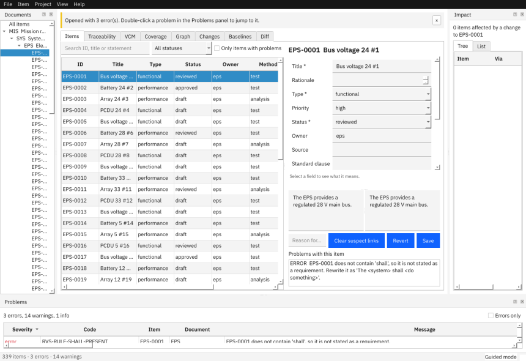
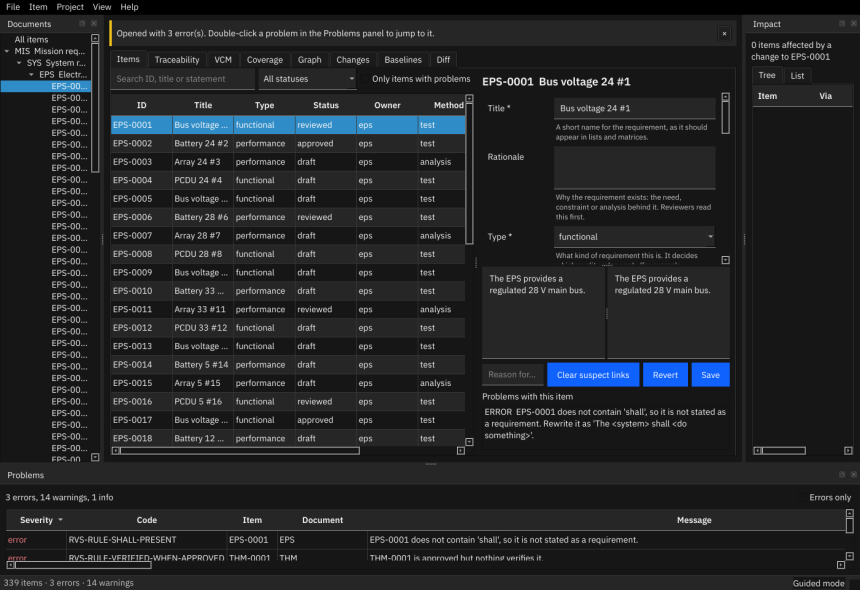

# Requirements & Verification Studio

This guide is part of the application and works without a network connection. Press **F1** in the application to open it. On the command line, `rvs guide` prints the path of the guide file (an HTML page you can open in any browser) and `rvs guide -o FILE` copies it to `FILE`.

Requirements & Verification Studio (RVS) manages requirements and their verification for engineering projects, with traceability, change control and baselines. Your data is stored as plain text files in a folder, so it can be kept under Git and read without RVS.

**Nothing leaves your computer.** RVS never connects to a network: there is no update check, no telemetry and no cloud service.

## What is Doorstop?

Doorstop (doorstop.dev) is an open-source requirements tool that keeps every requirement as a small text file (a *YAML* file) in a folder, groups them into *documents*, and links them to each other. RVS is built on Doorstop 3.2 and adds what a project needs on top: a desktop application, quality rules, verification tracking, matrices, change requests, baselines, reports and import/export. Your project is still a valid Doorstop project: you can read it, diff it and merge it with ordinary tools, and RVS ships the Doorstop version it was tested with, so you do not install Doorstop yourself. RVS does not use Doorstop's own review feature (see *Suspect links and review* in the reference).

## Terms used in this guide

| Term | Meaning |
|---|---|
| **Item** | One requirement or one verification item: one file such as `SYS-0012.yml`. Its **ID** (Doorstop calls it UID) is the document prefix and a number. |
| **Document** | A folder of items with a prefix, for example `SYS` (system requirements). Documents form a tree: each one except the top has a **parent document**. |
| **Root document** | The top document of the tree (no parent), for example the mission or system requirements. A project has exactly one. |
| **Statement** | The text of a requirement (Markdown). Doorstop calls this field `text`. |
| **Parent link** | A link from an item to the item it derives from, in the parent document. Doorstop calls these simply *links*. |
| **Typed link** | An extra relation between items, besides parent links. `satisfies`: this requirement also satisfies another one in a different branch. `refines`: this requirement details another. `verifies`: a verification item proves a requirement. `conflicts-with`: two requirements cannot both hold (it works in both directions). |
| **Verification item** | An item in a verification document that says how and whether a requirement is shown to be met (method, level, status, evidence). |
| **Derived** | An item that deliberately has no parent (it comes from a design decision, not from a higher requirement). The rule *has-parent* and the *orphan* gap in the traceability matrix skip derived items. |
| **Normative / header item** | A normative item is a real requirement. A non-normative item (often a heading, `header`) only structures the document: rules, matrices and counts ignore it. |
| **Level** | The position of an item in its document, such as `1.2`. It decides the order and the numbering in specification documents. |
| **Fingerprint attributes** | The fields whose change makes the links of children suspect: the statement plus *title, type, verification method and level* (set per document template). Status, owner and priority are deliberately not part of it. |
| **Suspect link** | A parent link whose parent changed (in a fingerprint attribute) after the link was last accepted. Review the parent, then clear it. |
| **Gap** | Something missing in the chain of evidence: a requirement without a child, a requirement without a parent (an *orphan*), a requirement nothing verifies. |
| **Provenance** | The block that every output carries: project, baseline (or *working copy*), generation date and time, user, tool and Doorstop version. |
| **Manifest** | The file `baselines/<name>.yaml` that lists every item of a baseline with its digest. |
| **Digest** | A SHA-256 fingerprint of an item's content. If one character changes, the digest changes, which is how tampering with a baseline is found. |
| **Change request (CR)** | A small record that asks for, explains and tracks a change. |
| **Baseline** | A named, frozen state of the whole project, bound to a Git tag. |
| **TODO-COMPANY / TODO-STANDARD** | Placeholders in `config/` for values your organisation (or a standard such as ECSS) has to supply. RVS never invents them and reports them until you replace them. |

RVS uses some everyday words in place of Doorstop's:

| In RVS | Doorstop / elsewhere |
|---|---|
| problem (in the Problems panel) | **finding**: every problem has a *code* such as `RVS-RULE-SHALL-PRESENT`, a message and a hint |
| ID | UID |
| statement | `text` |
| parent link | `links` |
| fingerprint attributes | *reviewed* attributes / stamps |
| working copy | the project files as they are now, as opposed to a baseline |
| specification (document export) | *publish* |

## Getting started

### Install and start

Run the installer for your system (see *Installation and checks* below) and start **Requirements & Verification Studio** from the application menu, or run `rvs-studio` in a terminal. **Help > About** shows the version of RVS and of Doorstop.

### Your first project

Choose one of three ways:

1. **File > Open Example** asks for a folder and creates a copy of a fictional example project inside it, in a new sub-folder named `rvs-example-minimal` or `rvs-example-satellite` (it refuses to use a folder that already exists and is not empty), then opens it. The *Small satellite* example has about 300 requirements, including a few seeded defects you can find in the Problems panel. Use this to explore. Example projects are not under Git; see *Control changes* before you create a baseline in one.
2. **File > New Project…** (Ctrl+Alt+N) creates an empty project from a template: *Minimal* (system, subsystem, verification plan), *Small satellite* (mission, system, seven subsystems, verification plan) or *Software product* (system, software, interfaces, tests). *Keep this project under Git version control* is ticked by default; leave it ticked if you want baselines.
3. **File > Open Project…** (Ctrl+O) opens an existing RVS project folder. **File > Open Recent** lists the last eight.

The same from the command line: `rvs init my-project --name "My project" --template satellite --git`. `--name` is required; `--git` is optional (without it the project is not under Git). `rvs init --list-templates` shows the templates.

### The window

- **Documents** (left): the document tree. Click a document to filter the item table; click an item to open it.
- **Items** tab: the table of items on the left, the editor on the right. Above the table: a search box, a status filter and *Only items with problems*.
- **Problems** (bottom): everything the project's quality rules and link checks found. Double-click a row to jump to the item. *Errors only* hides warnings and information.
- **Impact** (right): which items are affected if the selected item changes, as a *Tree* and as a *List*.
- Tabs for **Traceability**, **VCM** (verification control matrix), **Coverage**, **Graph**, **Changes**, **Baselines** and **Diff**.

The **View** menu switches the *Documents*, *Problems* and *Impact* panels on and off, chooses the table columns (*Columns*, or right-click the table header), lists the tabs, and holds *Mode* and *Theme*.

### Guided and expert mode

RVS starts in **guided mode**: a step-by-step wizard for new requirements, an explanation of the field you are editing and a roomy table. When you know the tool, switch to **expert mode** with **View > Mode** or **Ctrl+Shift+M**: a dense table you can edit directly, and the quick "new item" dialog. Your choice is remembered.

| | Guided | Expert |
|---|---|---|
| New requirement | Wizard with live quality hints | Small dialog (document, title, parents) |
| Field help | One help line under the form, for the field you are in (and tooltips) | Tooltips only |
| Item table | Read-only, comfortable rows | Dense rows, edit cells in place |

Both modes use the same data and the same rules; nothing is hidden in guided mode.

### Light and dark theme

**View > Theme** switches between a light theme, a dark theme and *Follow the system*. The choice is remembered.

### Help from the application

- **F1** opens this guide. **Ctrl+/** lists all keyboard shortcuts.
- Hover over any field in the editor to read what it means.
- Problems always say what is wrong *and* how to fix it.

## Installation and checks

### Installing on Linux

Unpack the release and run `./install.sh` in the unpacked folder. It installs for your user only and needs no administrator rights and no network.

- Program folder (the *prefix*): `~/.local/opt/rvs-studio`. `--prefix DIR` chooses another folder. The installer only replaces a folder that is missing, empty or was installed by it (it marks its own with a file `.install-prefix`), and never touches a folder it did not create.
- Commands `rvs` and `rvs-studio` are linked into `~/.local/bin`, and a menu entry is written to `~/.local/share/applications`. If `~/.local/bin` is not on your `PATH` the installer says so; add it to your shell profile.
- Options: `--no-selftest` skips the installation check at the end, `--skip-verify` installs without checking `MANIFEST.sha256` (not recommended).
- Before copying anything the installer checks every file against `MANIFEST.sha256` and refuses to install if one differs or an unlisted file is present.
- `./uninstall.sh` removes the program, the launchers and the menu entry and leaves your projects and settings untouched (`--purge-settings` also removes the settings). Running it a second time says *Nothing to remove* and ends with success.

**System libraries.** The bundle contains Python and Qt, but a graphical program needs a few libraries that every desktop Linux has or can install. On Debian and Ubuntu: `sudo apt-get install libegl1 libgl1 libxkbcommon0 libxkbcommon-x11-0 libfontconfig1 libdbus-1-3 libxcb-cursor0 libxcb-icccm4 libxcb-image0 libxcb-keysyms1 libxcb-render-util0 libxcb-xkb1 libxcb-util1`. On other distributions install the packages that provide the same files. The installer checks this with `ldd` and prints a *WARNING* naming what is missing; it still installs, because the `rvs` command line does not need these libraries.

**Minimum system.** The prebuilt bundle is built on Ubuntu 24.04 and needs **glibc 2.38 or newer** (Ubuntu 24.04, Debian 13, Fedora 39 and later). The installer warns when your glibc is older. On an older distribution (for example RHEL 8 or 9, Ubuntu 22.04) install from the wheelhouse with Python 3.11, 3.12 or 3.13: `pip install --no-index --find-links wheelhouse rvs` (see `docs/RELEASE.md`).

### Installing on Windows

Run `powershell -ExecutionPolicy Bypass -File install.ps1` in the unpacked folder. It installs for your user to `%LOCALAPPDATA%\Programs\rvs-studio` (`-Prefix DIR` chooses another folder), creates a Start-menu shortcut, runs the installation check (`-NoSelfTest` skips it) and does **not** change your `PATH`; call `rvs.exe` by its full path or add the folder to the `PATH` yourself. `uninstall.ps1` removes it (`-PurgeSettings` also removes the settings). **Caveat: the Windows installer and the Windows build have never been run on Windows.** Run `rvs.exe selftest --manifest <folder>` before relying on them.

### Checking an installation

`rvs selftest` checks the installed program: bundled fonts and configuration, a sample project, an export in every format (ReqIF included), a baseline in a scratch Git repository, and that the offline guard is active. It prints one line per check and exits with 0 when everything is fine. `rvs selftest --manifest <folder>` also verifies every installed file against `MANIFEST.sha256`, which shows whether files were damaged or altered after installation.

### Git

Baselines need the project folder to be a Git repository. RVS has its own built-in Git implementation, so **Git does not have to be installed** on your computer. It only ever works on local repositories: it never signs and never contacts a remote. Pushing or pulling stays with your normal Git tools.

### Where RVS keeps its own settings

Preferences are in a small `settings.json` in your user configuration folder: `~/.config/rvs` on Linux (or `$XDG_CONFIG_HOME/rvs`), `%APPDATA%\rvs` on Windows, `~/Library/Application Support/rvs` on macOS. Set `RVS_CONFIG_DIR` to use another folder. The file never contains project content. Its keys:

| Key | Meaning |
|---|---|
| `mode` | `"guided"` or `"expert"` |
| `theme` | `"light"`, `"dark"` or `"system"` |
| `recent` | the last eight projects opened |
| `shortcuts` | your shortcut overrides: action ID to key (see the table in the reference) |
| `geometry` | window size and position (an encoded string; delete the key to reset the window) |
| `layout` | which panels are shown and the widths of the item table's columns (encoded strings; delete the key to reset them) |

A broken or hand-edited file falls back to the defaults. Next to it RVS keeps a `crash` folder and a `cache.key` file (a random key that makes the speed-up cache of your projects tamper-evident; delete it and the caches are rebuilt).

### Names and users

The user name recorded in item histories, change requests, baselines and every output comes from your operating-system login. The commands that record something (`rvs import`, `rvs cr`, `rvs baseline create`) have `--user NAME` to override it.

### Environment variables

| Variable | Effect |
|---|---|
| `RVS_CONFIG_DIR` | Folder for `settings.json` and crash reports. |
| `SOURCE_DATE_EPOCH` | Seconds since 1970 (UTC). When set, it replaces the current time as the *generated* time of every output, so the same project state gives byte-identical files. |
| `RVS_DEBUG` | Set to `1` and the command line shows the full Python traceback of an internal error instead of a short message. |

### If something unexpected happens

RVS shows a plain message and writes a short report to the `crash` folder next to `settings.json`. The report contains the error type and program locations only, never requirement text, so it is safe to send to the maintainers. Your saved project files are not affected. The `rvs` command never prints a Python traceback: an internal error gives a one-line message and exit code 1 (set `RVS_DEBUG=1` to see the traceback).
