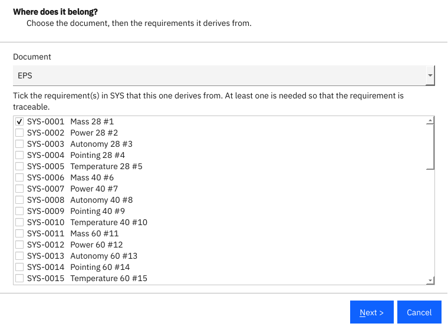
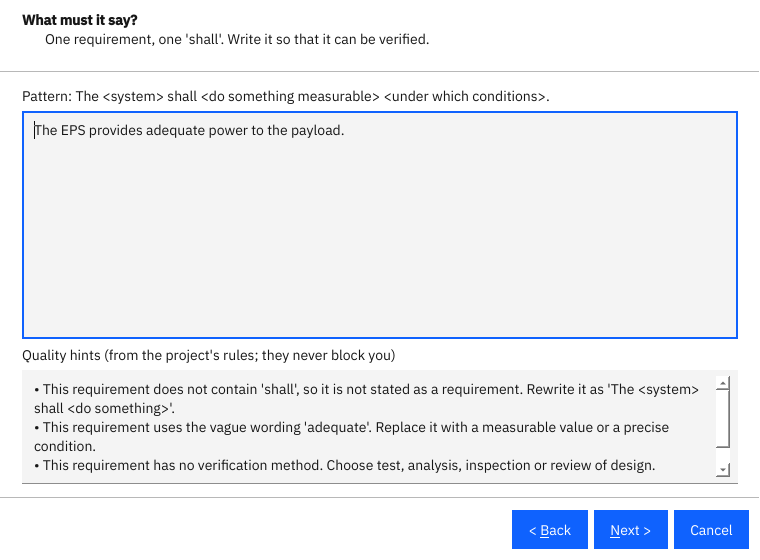
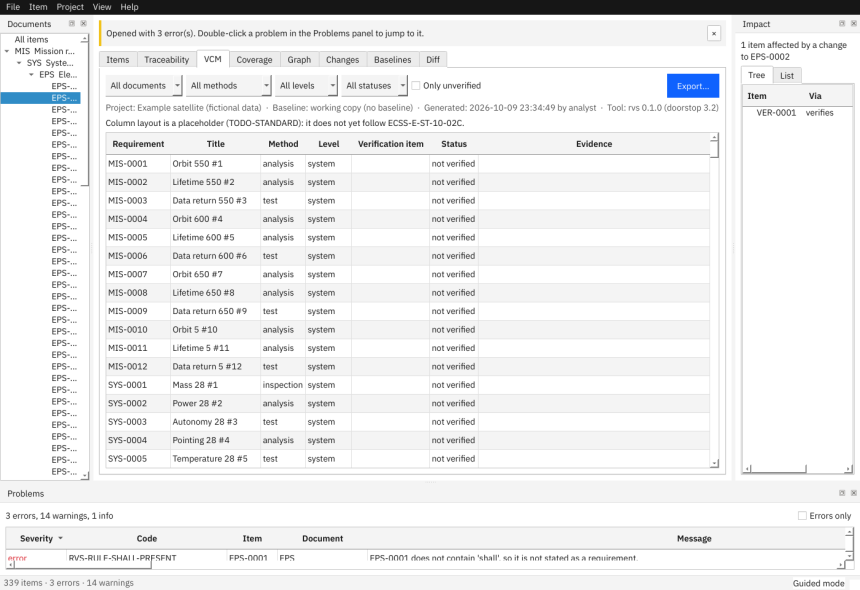
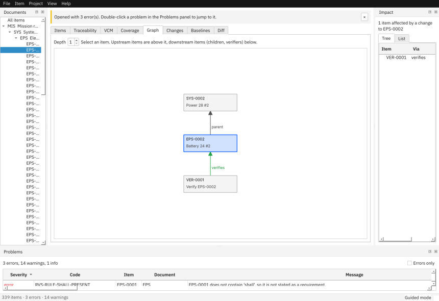

# Guided walkthrough

This walkthrough uses the *Small satellite* example (**File > Open Example**). Everything in it is fictional.

## 1. Find your way around

Click **EPS** in the Documents panel. The table shows the electrical power subsystem requirements. Select one: the editor on the right shows its statement, its fields (a help line explains the one you are in) and **Problems with this item**.

Use **Ctrl+F** to search by ID, title or statement, the status box to filter, and *Only items with problems* to see what needs attention. **Ctrl+G** jumps to an ID. **F8** and **Shift+F8** step through the items that have problems.

## 2. Write a new requirement

Press **Ctrl+N** (or **Item > New Requirement…**). The wizard has five steps:

1. **Where does it belong?** Pick the document. For every document except the top-level one, tick the parent requirement(s) it derives from; *Next* stays disabled until you do, because a requirement without a parent cannot be traced.
2. **What must it say?** Type the statement. Below it, quality hints appear while you type: a missing "shall", vague words such as "adequate", several requirements in one sentence, acronyms that are not in the glossary. The hints never block you. Undefined acronyms are underlined in red.
3. **Details.** Every field of the document template, with help text: title, rationale, type, priority, status, owner, source, standard clause, verification method and level, and the typed links. Fields marked * are required.
4. **How will you show it is met?** Tick *Also create a planned verification item* to create a linked verification item in the verification plan, using the method and level from the previous step.
5. **Review.** A summary of what will be created and everything the rules found. Click *Finish* to create the requirement; you can fix remaining hints later in the editor.

The new item is selected in the editor and a green message names the IDs that were created.

## 3. Edit an existing requirement

Select an item, change fields or the statement (the preview shows the formatted Markdown), and press **Ctrl+S**. **Ctrl+R** reverts.

- *Parents* completes item IDs from the parent document as you type.
- *Owner*, *Source* and similar fields complete from values already used in the project.
- If the item is baselined, a **reason for change** is required; type it in the box next to *Save*. The reason is stored in the item's history.
- **Clear suspect links** appears when a parent changed after this item was last reviewed. Review the parent first, then accept it.

## 4. Fix problems

Open the Problems panel. Each row has a code, the item, a message and **How to fix**. Examples: `RVS-RULE-SHALL-PRESENT` (add "shall"), `RVS-LINK-SUSPECT` (a parent changed; review and clear), `RVS-RULE-UNDEFINED-ACRONYM` (add the acronym to the glossary with **Project > Glossary and Acronyms…**, Ctrl+Shift+G). *Run Full Doorstop Validation* (Ctrl+Shift+V) additionally runs Doorstop's own tree checks.

## 5. See the whole picture

- **Traceability** shows which items of one document are linked from another, in both directions.

- **VCM** lists every requirement with its verification method, level and the verification items that cover it. Rows with gaps are shaded. Filter by document, method, level or status.
- **Coverage** shows, per document, how many requirements have children and verification.
- **Graph** draws the neighbourhood of the selected item.

- The **Impact** panel lists everything that depends on the selected item, so you can see what a change would touch.

## 6. Produce documents

**File > Export…** (Ctrl+E) writes a matrix, a specification document or the items table in HTML, DOCX, PDF, XLSX, CSV or JSON. Exports run in the background and name the project, the baseline (or "working copy") and the date.

## 7. Control changes

Raise a **change request** in the Changes tab, tick *Attribute my edits to this change request* and every edit you make is recorded against it. When a milestone is reached, create a **baseline** with **Project > New Baseline…**. See *Change control* for details.
