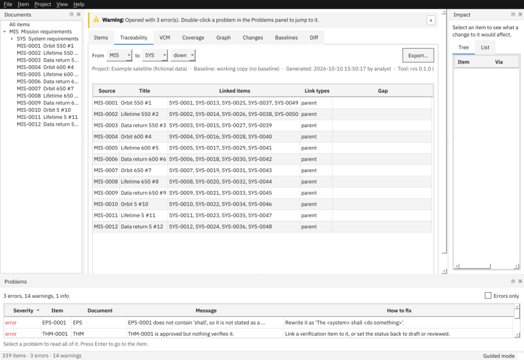

# Link and trace

This page shows how requirements are linked, how to read the traceability matrix, the graph and the impact list, and how to deal with suspect links.

## The kinds of link

| Link | Meaning | Where you set it |
|---|---|---|
| **Parent** | "this requirement comes from that one" (in the parent document) | the *Parents* field, or a tick box in the wizard |
| `satisfies` | this requirement also satisfies one in another branch | a field in the editor |
| `refines` | this requirement gives more detail on another | a field in the editor |
| `verifies` | a verification item proves a requirement | the verification item's *Verifies* field |
| `conflicts-with` | two requirements cannot both hold (works both ways) | a field in the editor |

Only **parent** links can become *suspect*; the others never do.

## See which items are linked

Open the **Traceability** tab, choose *From* and *to* documents and a direction.



- **down** lists, for each item, the items below it (children, verifiers).
- **up** lists the items above it.
- Gaps are shaded and named in the last column: *childless* (nothing below it), *orphan* (no parent), *unverified*.

Press Enter or double-click a row to open that item.

## See what a change would touch

Select an item: the **Impact** panel (right) lists everything that depends on it, as a *Tree* (by link) or a *List* (depth and the link followed). Items related by `conflicts-with` are named separately. On the command line: `rvs export PROJECT --impact SYS-0002`.

## Draw the neighbourhood

The **Graph** tab draws the selected item with its parents above and its children and verifiers below. The *Depth* box (1 to 4) sets how many links away to draw. Click a node to open that item.


## Deal with a suspect link

When a parent's statement (or its title, type, verification method or level) changes after you accepted the link, the child's link is *suspect* (`RVS-LINK-SUSPECT`).

1. Open the parent and read what changed.
2. Decide whether the child still holds; edit it if not.
3. Open the child and press **Clear suspect links** (it is always shown, and on only when there is something to clear).

RVS never clears suspect links by itself. Changing only a parent's *status*, *owner* or *priority* does not make links suspect.

## Make the matrix on the command line

```
rvs export PROJECT --trace SYS:SUB            # down (the default)
rvs export PROJECT --trace SUB:SYS:up -o up.xlsx
```

Next: [Check quality](04-check-quality.md) · [Verification](05-verification.md) · [Glossary: suspect link](../glossary.md#suspect-link)
