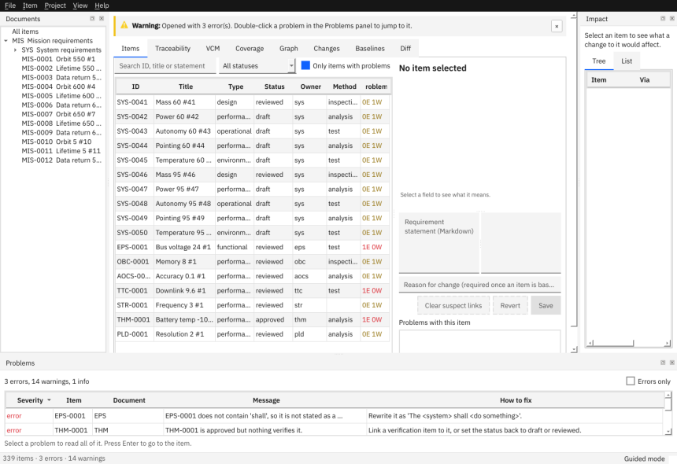

# Check quality

This page shows how RVS finds problems in a project, how to read them, and how to fix the common ones.

## Look at the problems

The **Problems** panel (bottom of the window) lists everything the quality rules and the link checks found. Each row has a severity (*error*, *warning*, *info*), the item, a message and **How to fix**. Select a row to read all of it; press Enter or double-click to jump to the item. *Errors only* hides the rest. **F8** and **Shift+F8** step through the items that have problems.



On the command line:

```
rvs validate PROJECT                  # text
rvs validate PROJECT --format json    # for scripts
rvs validate PROJECT --strict         # warnings count as errors
rvs validate PROJECT --fast           # skip Doorstop's own checks (big projects)
```

Exit code **0** means no errors, **1** errors (or warnings with `--strict`), **3** the project cannot be loaded.

## The common findings and their fixes

| Code | What it means | Fix |
|---|---|---|
| `RVS-RULE-SHALL-PRESENT` | no "shall" in the statement | write it as "The <system> shall <do something>" |
| `RVS-RULE-SINGLE-STATEMENT` | "shall" appears more than once | split it into two requirements |
| `RVS-RULE-VAGUE-WORDS` | a vague word such as "adequate" | give a measurable value |
| `RVS-RULE-UNDEFINED-ACRONYM` | an acronym is not in the glossary | **Project > Glossary and Acronyms…** (Ctrl+Shift+G), tab *Acronyms* |
| `RVS-RULE-VERIFY-METHOD-SET` | no verification method | choose one in the editor |
| `RVS-RULE-HAS-PARENT` | no parent requirement | link it to its parent, or set `derived` to `yes` by import |
| `RVS-RULE-VERIFIED-WHEN-APPROVED` | approved but nothing verifies it | add a verification item, or set the status back |
| `RVS-TRACE-NO-CHILD` | no child in the documents below | allocate it, or ignore it if nothing below needs it |
| `RVS-LINK-SUSPECT` | a parent changed | [deal with the suspect link](03-link-and-trace.md#deal-with-a-suspect-link) |

Every code is in the [guide's reference](../guide/07-reference.md#finding-codes).

## Lines you can ignore

- `INFO DOORSTOP-UNREVIEWED` and `DOORSTOP-EMPTY-DOCUMENT` are notices. RVS does not use Doorstop's review feature, so Doorstop reports each item as "needs initial review". Hide them with *Errors only*, or filter them: `rvs validate PROJECT | grep -E "^(ERROR|WARNING)"`.
- `INFO RVS-STD-PLACEHOLDER` says values marked `TODO-COMPANY` or `TODO-STANDARD` in `config/` are still placeholders. RVS never invents values that belong to your organisation or to a standard.

## Change what is checked

The rules, their severity, their parameters (such as the list of vague words) and whether they are on live in `config/rules.yaml`. For example, to make a rule only informational, set its `severity: info`. `no-implementation` ships with an empty list of terms, so it finds nothing until you add terms.

Next: [Verification](05-verification.md) · [Troubleshooting](../troubleshooting.md) · [Project files](10-project-files.md)
