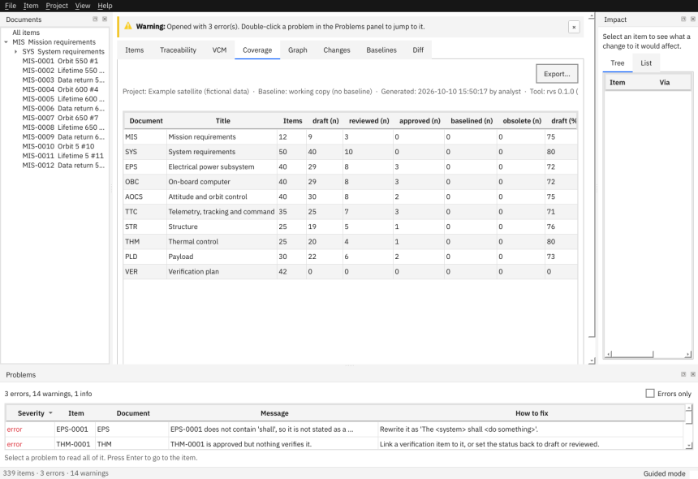

# Verification

This page shows how to say how each requirement is shown to be met, record results, and read the verification control matrix (VCM) and the coverage table.

## Create a verification item

- In the wizard (guided mode), step 4: tick *Also create a planned verification item*.
- Or **Item > New Verification Item…** (Ctrl+Shift+N), choosing the requirement(s) it verifies.

Verification items live in the verification document (for example `VER`) and link to the requirements they verify with `verifies`.

## Record a result

Select the verification item and fill in:

| Field | Meaning |
|---|---|
| **Procedure ID** (`proc_id`) | the test procedure or analysis report |
| **Verification method** and **level** | how and at which level; a method that differs from the requirement's is reported as `RVS-LINK-METHOD-MISMATCH` |
| **Verification status** (`v_status`) | `planned` (the default), `in-progress`, `passed`, `failed`, `waived` |
| **Evidence** | where the proof is, preferably a path inside the project folder (kept under Git) or a document number and revision |
| **Executed on** | the date, `YYYY-MM-DD` |
| **Responsible** | who carried it out or signs it off |
| **Non-conformances** | references to non-conformance reports (NCR), comma separated |

Press **Ctrl+S**. A requirement counts as *passed* only when every item that verifies it has passed (or been waived); *failed* as soon as one fails; *not verified* when nothing verifies it.

## Read the VCM

The **VCM** tab lists every requirement with its method, level, the verification items that cover it, their combined status and the evidence.

Filter by document, method, level or status; tick *Only unverified* to see what nothing verifies. The column layout is a placeholder (marked `TODO-STANDARD`): it does not yet follow ECSS-E-ST-10-02C, because RVS does not have that standard's text. Export it with the **Export…** button, or `rvs export PROJECT --vcm -o vcm.xlsx`.

## Read the coverage table

The **Coverage** tab shows, per document, how many items there are and what share has each status, and for requirements how many are *not verified*, *planned*, *in-progress*, *passed*, *failed* or *waived*.

Next: [Change control](06-change-control.md) · [Import, export and reports](07-import-export-reports.md) · [Glossary: VCM](../glossary.md#vcm)
