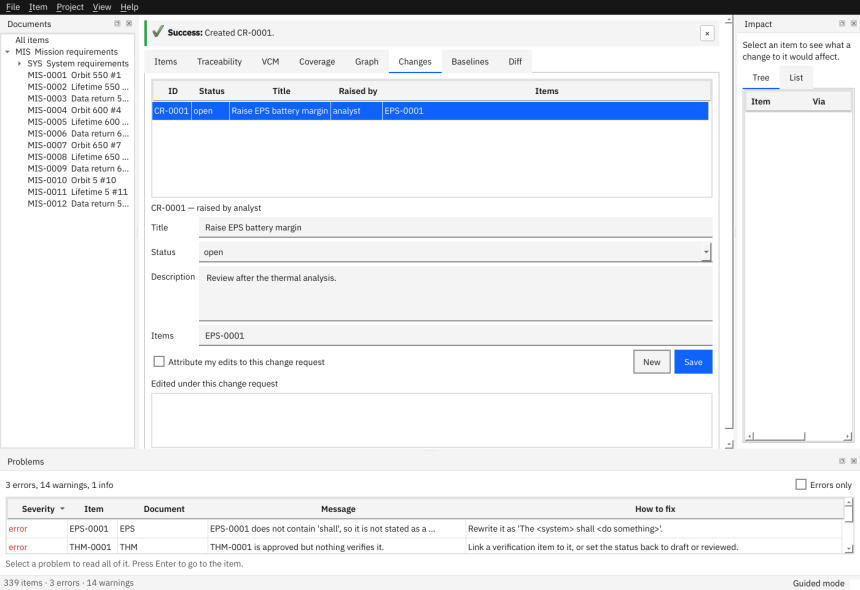
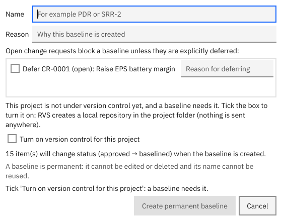
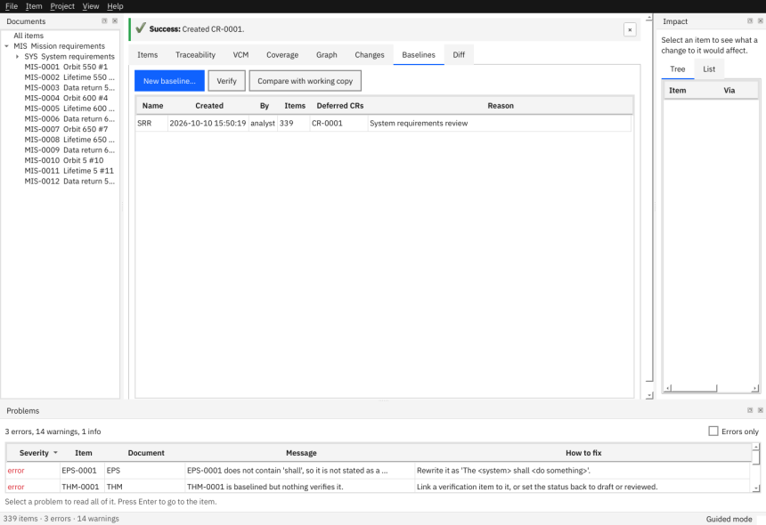

# Change control

This page shows how to record why something changed (change requests), freeze an agreed state (baselines) and see what changed between two states (diff).

**Contents:** [Change requests](#raise-a-change-request) · [Baselines](#create-a-baseline) · [Compare](#compare-two-states) · [Verify](#check-that-a-baseline-was-not-altered)

## Raise a change request

A change request (CR) records what you want to change, why, and which items it affects.

1. Open the **Changes** tab.
2. Fill in *Title*, *Description* and the affected *Items* (IDs, comma separated) and press **New**.
3. Later, pick its *Status* and press **Save**.



Tick *Attribute my edits to this change request* and every edit you make is recorded against it. Command line: `rvs cr new PROJECT "Raise battery margin" --item EPS-0001`, `rvs cr list PROJECT`, `rvs cr status PROJECT CR-0001 approved`.

Statuses (default): `open`, `in-review`, `approved`, `implemented`, `closed`, `rejected`, `deferred`. The first three **block a baseline**. They are configuration (`config/changes.yaml`), a starting point to adapt to your process.

## Create a baseline

A baseline is a named, frozen state of the whole project (for example `SRR`, `PDR`). It is bound to a Git tag, and it can never be changed or reused.

1. The project must be under Git. A project made with **File > New Project…** (default) or `rvs init --git` is. For the example projects, tick *Turn on version control* in the dialog.
2. Close your open change requests, or **defer** each one with a reason.
3. **Project > New Baseline…** (Ctrl+Shift+B): give a name and a reason, then **Create permanent baseline**.



Command line:

```
rvs baseline create PROJECT PDR -m "Preliminary design review"
rvs baseline create PROJECT PDR -m "..." --defer CR-0001="after PDR"
rvs baseline create PROJECT PDR -m "..." --init-git      # if the folder is not under Git yet
```

What happens: approved items become *baselined*; a manifest `baselines/PDR.yaml` records a fingerprint of every item; the project is committed and tagged `rvs/baseline/PDR`. From now on **every edit to those items needs a reason**. RVS never signs commits and never contacts a remote: pushing is up to you.



Names: 1 to 64 letters, digits, `.`, `_`, `-`; not `working`; not a Windows device name such as `CON`; not equal to an existing name apart from case.

## Compare two states

**Diff** tab, or:

```
rvs diff PROJECT PDR working          # a baseline against the working copy
rvs diff PROJECT SRR PDR --format html -o changes.html
```

Statements are compared word by word: in the window deletions are struck through and insertions underlined; in text output a deleted word is `[-old-]` and an inserted one `{+new+}`.

To produce a report *as it was* at a baseline: `rvs export PROJECT --vcm --baseline SRR -o vcm-srr.xlsx`.

## Check that a baseline was not altered

`rvs baseline verify PROJECT PDR` (or the **Verify** button) checks the tagged content against the manifest. `rvs validate PROJECT` also reports a changed manifest.

Next: [Import, export and reports](07-import-export-reports.md) · [Guide: change control](../guide/04-change-control.md) · [FAQ](../faq.md)
