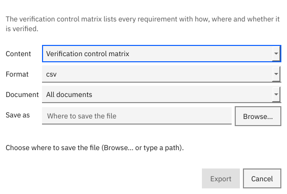
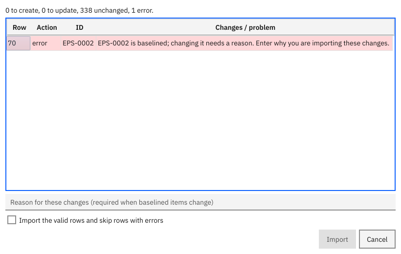

# Import, export and reports

This page shows how to get documents and matrices out of RVS, how to change many items in a spreadsheet, and how to exchange data with other tools.

**Contents:** [Export a report](#export-a-report-or-matrix) · [Specification document](#write-a-specification-document) · [Change many items in a spreadsheet](#change-many-items-in-a-spreadsheet) · [ReqIF](#exchange-with-other-tools-reqif)

## Export a report or matrix

In the window: **File > Export…** (Ctrl+E), or the **Export…** button on a matrix tab.

On the command line the content is chosen by a flag and the format by the file name:

| Content | Command | Formats |
|---|---|---|
| Verification control matrix | `rvs export P --vcm -o vcm.xlsx` | csv, json, xlsx, html, docx, pdf |
| Traceability matrix | `rvs export P --trace SYS:SUB -o trace.csv` | same |
| Coverage | `rvs export P --coverage -o coverage.pdf` | same |
| Impact of one item | `rvs export P --impact SYS-0002` | same |
| Specification | `rvs export P --spec -o spec.docx` | html, docx, pdf |
| All items | `rvs export P --items -o items.xlsx` | csv, xlsx |
| Exchange file | `rvs export P --reqif -o p.reqif` | reqif |

Without `-o`, text formats print to the screen; `xlsx`, `docx` and `pdf` need `-o`. Every file names the project, the baseline (or *working copy*), the date and time, the user and the tool versions. Files are written whole or not at all.

**Same input, same bytes.** Set `SOURCE_DATE_EPOCH` (seconds since 1970, UTC) to fix the generation time and two exports of the same state are byte-identical.

## Write a specification document

`rvs export PROJECT --spec -o spec.html` (or `.docx`, `.pdf`) writes the requirements of every document, or of one with `--document SYS`, as a readable specification.

## Change many items in a spreadsheet

1. Export the table: `rvs export PROJECT --items -o items.xlsx`.
2. Edit it in Excel or LibreOffice. Do not change the column names. Leave `id` empty (or use a new number above the highest) to create items.
3. Preview: `rvs import PROJECT items.xlsx --dry-run`. It lists every row that would be created, updated or refused (with the row number) and counts the unchanged ones.
4. Apply: `rvs import PROJECT items.xlsx --reason "Renumbered after review"`.

In the window: **File > Import Items…** shows the same preview with a box for the reason.

Good to know:

- Nothing is written unless every row is valid, or you pass `--skip-errors`.
- A table with only `id` and `title` columns changes only titles.
- A reason is required for items that are in a baseline.
- This is also the only way to set `derived`, `normative`, `active`, `level`, `header` and `ref`: write `yes` or `no`.
- Text that starts with `=`, `+`, `-` or `@` is protected in CSV so a spreadsheet will not run it as a formula.

## Exchange with other tools (ReqIF)

ReqIF is the standard exchange format for requirements tools. `rvs export PROJECT --reqif -o p.reqif` writes one; `rvs import PROJECT p.reqif --dry-run` reads one (`--document PREFIX` names the target document, `--map "Their name=column"` maps an attribute). A file that RVS wrote reads back unchanged. RVS has not been tested against a particular third-party tool, and the files could not be checked against the official schema offline. See [tips](../tips.md#working-with-other-tools).

Next: [The command line](08-command-line.md) · [Guide: import and export](../guide/05-import-export.md) · [Tips](../tips.md)
