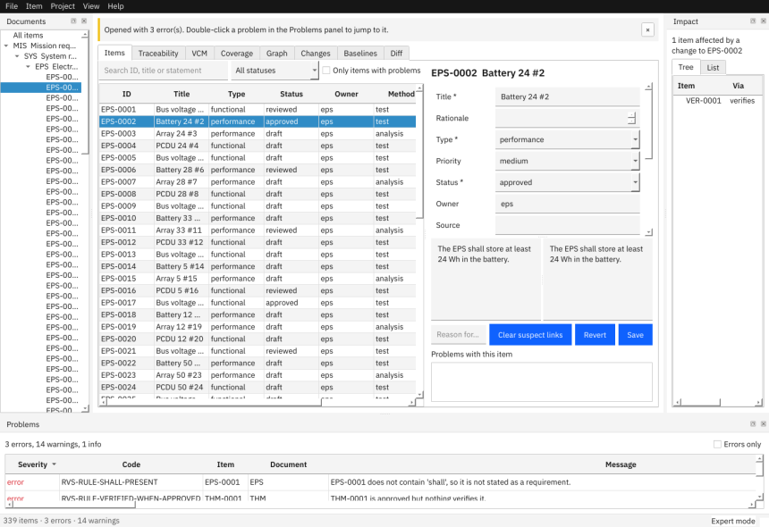

# Modes, themes, shortcuts, settings

This page shows how to switch between guided and expert mode, change the theme, learn the keyboard shortcuts, and find where RVS keeps its own settings.

## Guided and expert mode

| | Guided (the default) | Expert |
|---|---|---|
| New requirement | wizard with live quality hints | small dialog |
| Field help | one help line under the form | tooltips only |
| Item table | read-only, roomy | dense, edit cells in place |

Switch with **View > Mode** or **Ctrl+Shift+M**. Both modes use the same data and the same rules; nothing is hidden in guided mode. Your choice is remembered.



## Light and dark theme

**View > Theme**: light, dark, or follow the system.

## Shortcuts you will use most

| Keys | Action |
|---|---|
| Ctrl+O / Ctrl+Alt+N | open a project / create one |
| Ctrl+N / Ctrl+Shift+N | new requirement / new verification item |
| Ctrl+S / Ctrl+R | save / revert the item |
| Ctrl+F / Ctrl+G | search / go to an ID |
| F8 / Shift+F8 | next / previous problem |
| F6 / F4 | move to the Problems panel / into the editor |
| Ctrl+1 … Ctrl+8 | switch tabs |
| Ctrl+E | export |
| Ctrl+Shift+B | new baseline |
| F5 | refresh |
| F1 / Ctrl+/ | user guide / list all shortcuts |

The complete table is in **Help > Keyboard Shortcuts** and in the [guide's reference](../guide/07-reference.md#keyboard-shortcuts). **Tab** and **Shift+Tab** move between controls; inside a table the arrow keys move between cells and Tab leaves the table.

## Change a shortcut

Open `settings.json` (below) and add the action ID and a key, for example:

```
{"shortcuts": {"export": "Ctrl+Alt+E"}}
```

The action IDs are in the guide's reference. A key Qt cannot read, or one another action already uses, is ignored.

## Where settings are kept

`settings.json` is in your user configuration folder: `~/.config/rvs` on Linux (or `$XDG_CONFIG_HOME/rvs`), `%APPDATA%\rvs` on Windows, `~/Library/Application Support/rvs` on macOS. Set `RVS_CONFIG_DIR` to use another folder. It never contains project content. Keys: `mode`, `theme`, `recent`, `shortcuts`, `geometry`, `layout` (window panels and column widths). A broken file falls back to defaults. To reset the window, delete the `geometry` and `layout` keys.

Next: [Project files](10-project-files.md) · [Tips](../tips.md) · [Guide: expert walkthrough](../guide/03-expert-walkthrough.md)
